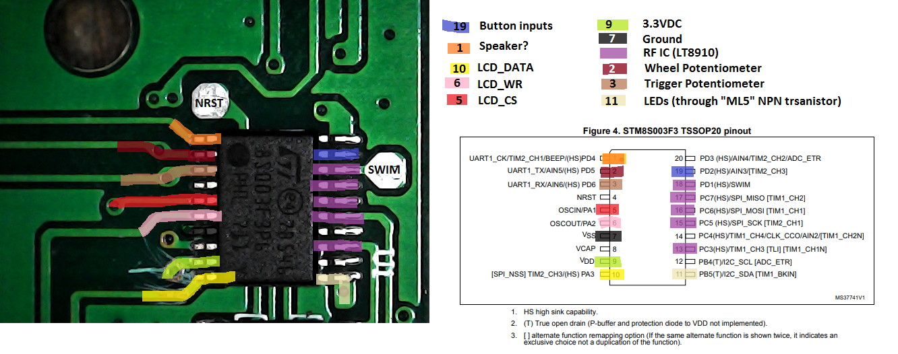
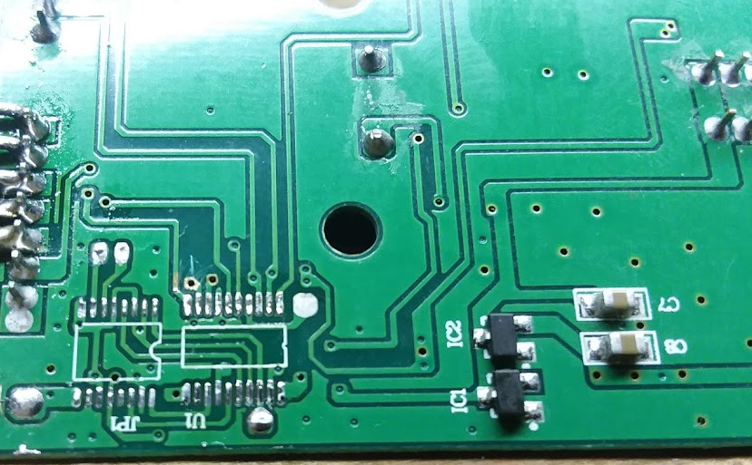

# jjrc_xinput_controller 
</img>  
Custom [Teensy](https://www.pjrc.com/teensy/) based RC controller for FRC using XBOX Controller Driver (XINPUT). Thanks to the [MSF-XINPUT](https://github.com/zlittell/MSF-XINPUT) library for making this easy.  
Supports buttons, analog sticks (with built in calibration), rumble motors, and LED control.
-  Implemented using the JJRC Q35-01 transmitter which retails for around $15
-  Using Teensy 3.5 for testing, plan to ultimately target the TeensyLC
-  10mm x 2mm Pancake Vibration Motor
-  HT1621 LCD driver chip (integral to Q35-01)

## Source Files
*  __/jjrc_xinput_controller/__ - *Arduino project directory*
    *  __src/fSevSeg__ - *Helper class for sending numerical data to the LCD (seven segment displays)*
    *  __src/ht1621_LCD__ - *Helper class for interacting with the ht1621 LCD controller and mapping specific LCD segments for the JJRC controller.*
    *  __jjrc_xinput_controller.ino__ - *Main arduino source*
*  __/logic_analyzer/__ - *Summary and raw data collected between the stock microcontroller, in the JJRC transmitter, and the ht1621 LCD controller. raw captures can be viewed in [Saleae Logic](https://www.saleae.com/downloads/)*
*  __/images/__ - *Pictures referenced from project markdown/readme files*

## Software Setup Instructions:
-  Install [Arduino IDE](https://www.arduino.cc/en/Main/Software)
-  Install [TeensyDuino](https://www.pjrc.com/teensy/td_download.html)
-  Install [MSF-XINPUT](https://github.com/dmadison/MSF-XINPUT) into arduino libraries folder (e.g. C:\Program Files (x86)\Arduino\libraries\MSF_XINPUT).
-  Copy files from the MSF-XINPUT 'Teensyduino Files that were edited' directory into the hardware directory within the arduino installation directory (e.g. C:\Program Files (x86)\Arduino\hardware).
-  Select your Teensy board from Tools > Board in Arduino IDE
-  Select Tools > Usb Type > XInput
-  Deploy this sketch to Teensy

## JJRC control board pinout

The STM8S003F3 (U1), RF chip (JP1), antenna, and crystal oscillator were desoldered from the main control board. All Teensy IO signals come back to this central location. The picture above identifies where relevant signals are located on the PCB. These signals need to be wired up to the Teensy at the pins designated in the source code. 
Note that the pad spacing for the STM8S makes hand soldering to these pins difficult. In most cases there are test points or vias in close proximity to the STM pads. Carefully removiving the soldermask above these locations will make soldering to the PCB easier.  

  

| Signal Name | Teensy Pin | Destination solder point | Notes |
| :---------- | :--------: | :----------------------- | :---- |
| LEDs        | 13         | Test point pad adjacent to STM pin 11 | Controls whether the LED backlights behind buttons are illuminated. |
| LCD CS      | 10         | LCD JST header pin | |
| LCD WR      | 11         | LCD JST header pin | |
| LCD DATA    | 12         | LCD JST header pin | |
| Wheel Position | 14      | Wheel potentiometer JST header | |
| Trigger Position | 15    | Trigger potentiometer JST header | |
| Buttons     | 16         | Via adjacent to STM pin 19. Under STM IC when board is populated | All buttons state fed to this input through resistive network. |
| Vibe Motor 1 | 22        | vibration motor circuit | |
| Vibe Motor 2 (TBD) | 23        | vibration motor circuit | |

### STM8S Reuse
__NOTE:__ *It should be possible to re-program the STM8 onboard this PCB.
It looks like worst case the manufacturer could have enabled the read-out protection (ROP) feature on the processor. ROP will prevent program memory from being read. The ROP register can be cleared however, allowing the device to be re-programmed. Clearing the ROP register has the side effect of erasing the contents of memory however.  
This approach isn't being persued further due to the lack of USB support in the STM8S chip. If a USB interface/peripherial could be added that would allow the device to report as a USB XInput device, this would likely be the preferred path forward as it would minimize hardware rework required.*  
-  See section 4.5.1 of [RM0016 Reference manual](https://www.st.com/content/ccc/resource/technical/document/reference_manual/9a/1b/85/07/ca/eb/4f/dd/CD00190271.pdf/files/CD00190271.pdf/jcr:content/translations/en.CD00190271.pdf)
-  [STM8S datasheet](https://www.st.com/resource/en/datasheet/DM00024550.pdf)
-  [PM0051 Programming manual](https://www.st.com/content/ccc/resource/technical/document/programming_manual/0f/82/71/32/87/2a/46/f2/CD00191343.pdf/files/CD00191343.pdf/jcr:content/translations/en.CD00191343.pdf)

### TeensyLC Pinout

### Teensy 3.5 Pinout
</img></img>

## Rumble Circuit
The Teensy analog output pins run up to 3.3v and cannot source a significant current. To drive the vibration motors from the Teensy, a circuit like the following can be used:  
  
This allows the motor to run at higher voltages than the Teensy's analog output cann support, and allow the current driving the motor to be supplied through the transistor instead of through the Teensy's output pin. The transistor should be chosen to meet the current and voltage demands of your specific motor. In my case, I'm using a 2N3904 transistor. The vibration motor being used draws ~100mA at 5V 100% duty.  
Note that the software drives this transistor from an analog output channel on the Teensy. Analog outputs achieve their varrying voltage outputs by [pulse width modulating](https://en.wikipedia.org/wiki/Pulse-width_modulation) (PWM) the output pin. In other words, when the software is set to output its full output voltage (3.3v) the output is always high. When the software is set to output half the output volgate (1.65v) the output is high (3.3v) half the time, and low (0v) half the time. The percentage of time the output is high is called the duty cycle.  
We're able to plug a transistor into this analog outputpin, because of the fact that it's actually a digital output being PWMed. The signal ocming out of the analog pin is always either 3.3v or 0v. As long as the transistor's switching times can keep up with the frequency that the analog output pin is being driven, then the motor's speed will be controllable from the Teensy. The analog pin's voltage % output will be 1:1 with the percentage of the bus voltage driving the motor.

## LCD Interface
A USB logic analyzer was used to monitor communications between the stock microcontroller and the LCD. Using these communication dumps and the names used for pins on the LCD PCB, it was possible to identify the LCD driver chip as most likely being a HT1621 (the IC driving the lcb is below an unmarked epoxy blob).

For details on how the LCD driver chip works refer to: https://www.seeedstudio.com/document/HT1621.pdf

The HT1621 LCD driver chip has a fairly simple command interface. Communications with the LCD happen over a three pin interface (CS, WR, DATA).
-  **CS** (Chip Select) - held low when communicating with the LCD. Appears as though this pin must transition high between commands.
-  **WR** (Write) - Clocks in the data into the LCD. State of Data pin read on rising edges of WR. 
-  **DATA** (Data) - the data to be clocked into the LCD 

The commands allow direct control of the LCDs display memory. Memory is organized in 32 segments (6 address bits). Each segment contains 4 data bits. This organization structure directly maps to the physical interface this chip has to the LCD itself,  4 COM lines and 32 SEG lines. This allows up to 32x4 unique patterns to be displayed on the LCD. "Up to" because this is dependant on how many segments are actually present on the LCD and how it was wired.  
The HT1621 supports arbitrarily writing to any memory segment or a speed optimized command which allows writing data to successive segments without continually providing the address to write into. While this would improve performance, it looks like the stock implementation doesn't bother using this command. It walks successive memory addresses, but always uses the verbose write command (providing the explicit memory address along with each 4 bit data block). My only guess as to why the developers may have written their software this way (other than just being lazy) is that there may be some fault tolerance provided. If data were to be malformed/corrupted, there's no way for one fault to propogate through the remainder of your data set. Worst case you have a single segment get corrupted.

See the data captures and readme file within the [logic_analyzer](https://github.com/jcorcoran/jjrc_xinput_controller/tree/master/logic_analyzer) directory for more info on the LCD commmunications interface.
