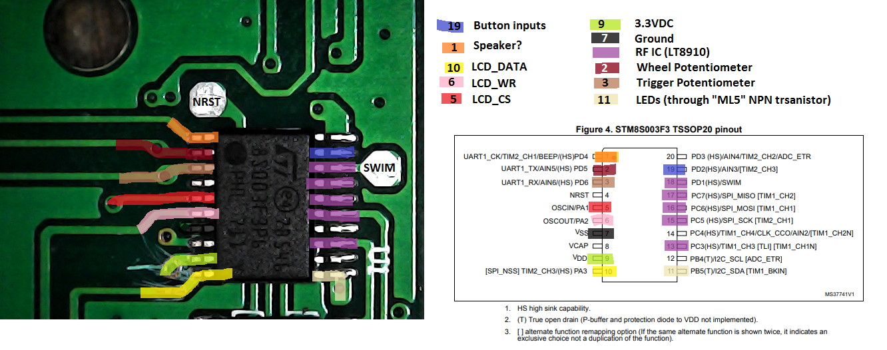

# jjrc_xinput_controller 
</img>  
Custom [Teensy](https://www.pjrc.com/teensy/) based RC controller for FRC using XBOX Controller Driver (XINPUT). Thanks to the [MSF-XINPUT](https://github.com/zlittell/MSF-XINPUT) library for making this easy.  
Supports buttons, analog sticks, and rumble.
-  Implemented using the JJRC Q35-01 transmitter which retails for around $15
-  Using Teensy 3.5 for testing, plan to ultimately target the TeensyLC
-  10mm x 2mm Pancacke Vibration Motor
-  HT1621 LCD driver chip (integral to Q35-01)

## Software Setup Instructions:
-  Install Arduino IDE
-  Install TeensyDuino
-  Install MSF-XINPUT into arduino libraries folder. Copy files from the 'Teensyduino Files that were edited' directory into the hardware directory within the arduino installation directory.
-  Select your Teensy board from Tools > Board in Arduino IDE
-  Select Tools > Usb Type > XInput
-  Deploy this sketch to Teensy

## JJRC control board pinout

The Plan is to desolder the STM8S003F3 and RF chips from the RC transmitter's main control board. All Teensy IO signals come back to this central location. The picture above identifies where relevant signals are located on the PCB. These signals need to be wired up to the Teensy at the pins designated in the code.

### TeensyLC Pinout

### Teensy 3.5 Pinout
</img></img>

## Rumble Circuit
The Teensy analog output pins run up to 3.3v and cannot source a significant current. To drive the vibration motors from the Teensy, a circuit like the following can be used:  
  
This allows the motor to run at higher voltages than the Teensy's analog output cann support, and allow the current driving the motor to be supplied through the transistor instead of through the Teensy's output pin. The transistor should be chosen to meet the current and voltage demands of your specific motor. In my case, I'm using a 2N3904 transistor. The vibration motor being used draws ~100mA at 5V 100% duty.  
Note that the software drives this transistor from an analog output channel on the Teensy. Analog outputs achieve their varrying voltage outputs by [pulse width modulating](https://en.wikipedia.org/wiki/Pulse-width_modulation) (PWM) the output pin. In other words, when the software is set to output its full output voltage (3.3v) the output is always high. When the software is set to output half the output volgate (1.65v) the output is high (3.3v) half the time, and low (0v) half the time. The percentage of time the output is high is called the duty cycle.  
We're able to plug a transistor into this analog outputpin, because of the fact that it's actually a digital output being PWMed. The signal ocming out of the analog pin is always either 3.3v or 0v. As long as the transistor's switching times can keep up with the frequency that the analog output pin is being driven, then the motor's speed will be controllable from the Teensy. The analog pin's voltage % output will be 1:1 with the percentage of the bus voltage driving the motor.

## LCD Interface
For details on how the LCD driver chip works refer to: https://www.seeedstudio.com/document/HT1621.pdf
