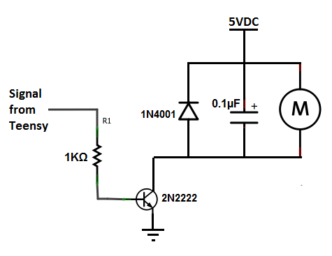

# jjrc_xinput_controller

Teensy based RC controller for FRC using XBOX Controller Driver (XINPUT) 
Supports buttons, analog sticks, and rumble.
Originally implemented using the JJRC Q35-01 transmitter which retails for around $15
-  Teensy 3.5
-  10mm x 2mm Pancacke Vibration Motor
-  HT1621 LCD driver chip (integral to Q35-01)

## Software Setup Instructions:
-  Install Arduino IDE
-  Install TeensyDuino
-  Install MSF-XINPUT into libraries foder. Copy files into hardware directory.
-  Select yout Teensy board from Tools > Board in Arduino IDE
-  Select Tools > Usb Type > XInput
-  Deploy sketch to Teensy

## Rumble Circuit
The teensy analog output pins run up to 3.3v and cannot source a significant current. To drive the vibration motors from the teensy, and circuit like the following should be used:

